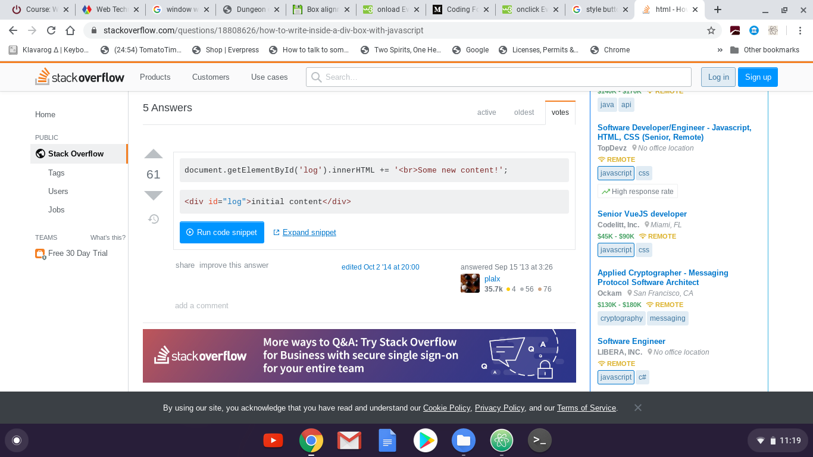

#HW 3

This week was very hard for me, but mainly because I had to travel cross country, and it took up a majority of my time. But still I believe I was able to take what I did last week and take it a little bit farther.

For me, there are still a few things that are really bothering me on this project. First is, I do not want to be telling my adventure through alerts, confirms and prompts. I want my story to be told in an box that scrolls as the story progresses. Similar to Zork or Hitchhiker guide to the galaxy. I do not want multiple choice answers. I want the person to guess the correct answers till they solve the puzzle. But I just couldnt find what I was looking for. My idea was that I could create a box, add overflow, and then tell the story in there. but I realized that would not leave oppurtunity for response. I also didnt know how I would update the story in the box

This is what I found as far putting document.write to a specific div. But it just wasnt right.

In the end, I was running out of time and couldnt spend anymore time researching how to do it, And every video I found was someone doing it through alerts boxes.

The other thing that bothers me, is in my code, if you answer no on any of the alert boxes, it cycles through all my "else" responses and I cant figure out why.

Overall, Im looking forward to being able to refine and add on to this project this week.
